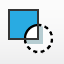
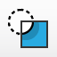
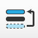
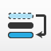

Nimbling_Scripts
================

Scripts to enhance graphic workflows in Illustrator and/or Mac OS X

I have these scripts bound to shortcuts using redsweaters' Fastscripts - replacing several illustrator native shortcuts (taking care to remove them from illustrator) and adding a few.

I have them set up like this:

###Clip scripts###
 
* (CMD + 7) "Clipper.jsx". AND (CMD + ALT + CTRL + 7) "Bottomclipper.jsx".

These clip scripts attempt to copy the initial objects appearance and paste it to the resulting clipping mask. Due to illustrator limitations this only works for single stroke, single fill appearances.
Ideal for cell shading objects. Allowing for a super smooth workflow when used with Astute Graphics' Dynamic Sketch; Simply draw an object, draw the shadow / highlight bits, select both and execute the "Bottomclipper".

###Send behind… & Bring in Front of…###
 
* (CMD + CTRL + SHIFT + [ ) & (CMD + CTRL + SHIFT + ] )

Put the selected objects in front of the topmost- or behind the bottom object of the selection. Useful when you use large amounts of objects and you just keep pressing "backward" or "forward" without revealing or eclipsing your other, chosen object.
*Fun fact: these even work when either object is inside- or outside of a clipping group, allowing you to add or remove an object from a clipping group super quick*

###Outliner###

* (CMD + SHIFT + O) "Outline Stroke and Text.jsx"
Outline both text and stroke, using the shortcut previously reserved only for text.

###Swap object colors###
* (CMD + ALT + CTRL + S) "Swap Object Colors.jsx"
This script swaps the colors (stroke and-or fill) of exactly TWO selected objects.

###Flip Horizontal & Vertical###
* (CMD + SHIFT + H) & (CMD + SHIFT + V)
Flip Horizontal and Vertical.

###Axonometry scripts###
    
* The Axonometry folder contains five illustrator actions sets that emulate different axonometries,
of which the “SSR 30º” & “ISO 45º + Vertical scale” are likely what you want.
The “Flatland -20º & 30º” set is the one I used to create the cabinet
at http://nimbling.com/graphic.html
